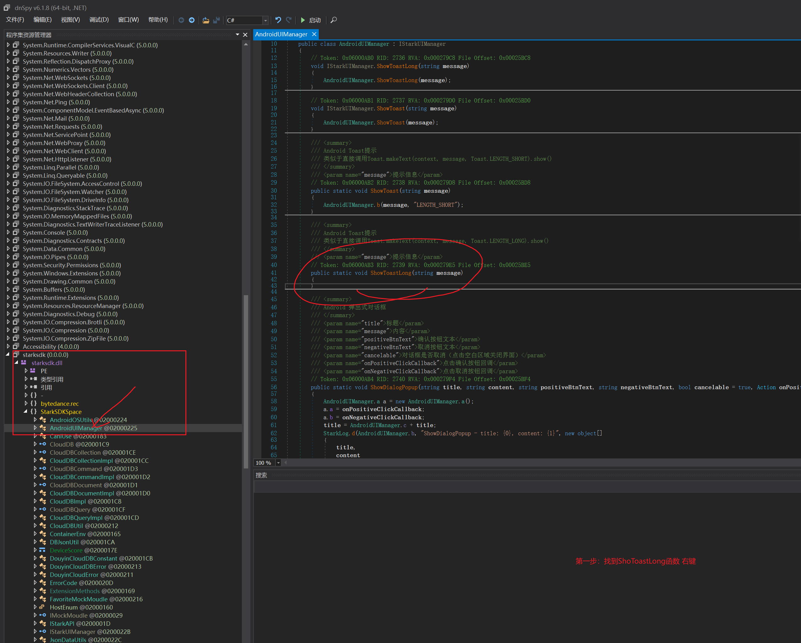
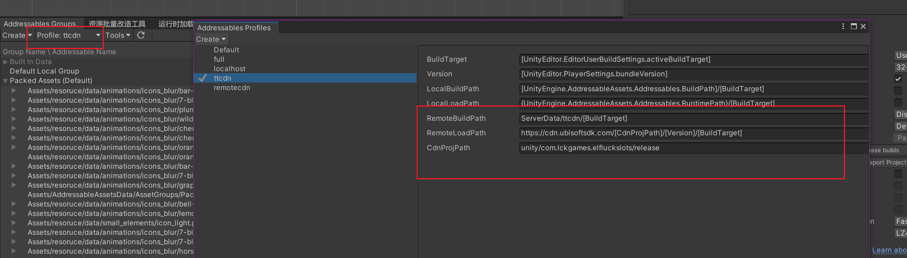

# DouyinSDK_Unity
去掉抖音StarkSdk Unity 导出Android工程提示警告，替换掉YooAssets热更新方案，简单、快速、安全。

主要适用于Unity 热更新资源相关的所有用途，简化所有热更新的操作更新，适用于新手和老手。

### 版本要求：
- Unity 2021.3.xx
- windows
- Mac OS X
- Android 6+

以下是使用教程和官网一模一样，只是需要替换核心文件starksdk.dll ：

